<p align="center">
  
</p>

<p align="center">
  <a href="https://github.com/vigneshwarreddy-jpg">
    
  </a>
</p>

<p align="center">
  <a href="mailto:vigneshwarreddy402@gmail.com">
    
  </a>
  <a href="https://www.linkedin.com/in/vigneshwarreddy/">
    
  </a>
  <a href="https://github.com/vigneshwarreddy-jpg">
    
  </a>
  
</p>

---

##  About Me

```js
const vigneshwar = {
    pronouns: "he" | "him",
    location: "Hyderabad, India 🇮🇳",
    education: "B.Tech in AI & ML — CMR Institute of Technology (2022-2026)",
    roles: ["Full Stack Developer", "AI/ML Engineer", "Python Developer"],
    currentFocus: "Building intelligent full-stack web applications",
    funFact: "I believe every bug is just an undocumented feature 🐛"
};
```


- 🔭 I'm currently working on **AI-powered web applications**
- 🌱 I'm learning **Advanced Deep Learning & Cloud Deployment**
- 👯 I'm looking to collaborate on **Open Source ML & Full Stack Projects**
- 💬 Ask me about **Python, React, NLP, Machine Learning**
- 📫 Reach me at **vigneshwarreddy402@gmail.com**
- 📍 Based in **Hyderabad, India** — Open to relocate
- ⚡ Fun fact: I built a full-stack temple locator for all temples across India 🛕

<br clear="both"/>

---

## 🛠️ Tech Arsenal

<p align="center">
  
</p>

<p align="center">
  
</p>

<details>
<summary><b>📋 Detailed Tech Stack (click to expand)</b></summary>

<br/>

| Category | Technologies |
|---|---|
| **Languages** |      |
| **Frontend** |   |
| **Backend** |   |
| **AI/ML** |     |
| **NLP** |   |
| **Databases** |   |
| **Tools** |    |
| **Data Viz** |   |

</details>

---

## 🚀 Featured Projects

<p align="center">
  <a href="https://github.com/vigneshwarreddy-jpg?tab=repositories">
    
  </a>
  <a href="https://github.com/vigneshwarreddy-jpg?tab=repositories">
    
  </a>
</p>

<table>
  <tr>
    <td width="50%" valign="top">
      <h3 align="center">🔍 Fake News Detection</h3>
      <p align="center">
        
        
        
        
      </p>
      <p>
        ✅ ML-based system using NLP, TF-IDF & Passive Aggressive Classifier<br/>
        ✅ End-to-end pipeline: tokenization → lemmatization → feature engineering<br/>
        ✅ Flask web app for real-time news classification<br/>
        ✅ Evaluated with accuracy, precision, recall & F1-score
      </p>
    </td>
    <td width="50%" valign="top">
      <h3 align="center">🛕 Temple Locator India</h3>
      <p align="center">
        
        
        
        
      </p>
      <p>
        ✅ Full-stack website displaying temples across India<br/>
        ✅ React frontend + Python backend with RESTful APIs<br/>
        ✅ Map-based location features for temple navigation<br/>
        ✅ Responsive UI with efficient backend data handling
      </p>
    </td>
  </tr>
</table>

---

## 📊 GitHub Analytics

<p align="center">
  <a href="https://github.com/vigneshwarreddy-jpg">
    
    
  </a>
</p>

<p align="center">
  <a href="https://github.com/vigneshwarreddy-jpg">
    
  </a>
</p>

<p align="center">
  <a href="https://github.com/vigneshwarreddy-jpg">
    
  </a>
</p>

---

## 🏆 GitHub Trophies

<p align="center">
  <a href="https://github.com/vigneshwarreddy-jpg">
    
  </a>
</p>

---

## 🎓 Education & Certifications

```
🎓 B.Tech in AI & ML          │  CMR Institute of Technology      │  2022 — 2026  │  GPA: 7.0/10
📜 Google AI-ML Internship     │  Google (Virtual)                 │  Sep 2024
📜 Full Stack Development      │  Innomatics Research Lab          │  Mar 2026
💼 Python Intern               │  E-code Learning Software, Hyd   │  Jun — Jul 2024
```

---

## 🐍 Contribution Snake

<p align="center">
  <picture>
    <source media="(prefers-color-scheme: dark)" srcset="https://raw.githubusercontent.com/vigneshwarreddy-jpg/vigneshwarreddy-jpg/output/github-snake-dark.svg" />
    <source media="(prefers-color-scheme: light)" srcset="https://raw.githubusercontent.com/vigneshwarreddy-jpg/vigneshwarreddy-jpg/output/github-snake.svg" />
    
  </picture>
</p>

---

<p align="center">
  
</p>

<p align="center">
  
</p>

<p align="center">
  <i>"Code is like humor. When you have to explain it, it's bad." — Cory House</i>
</p>
